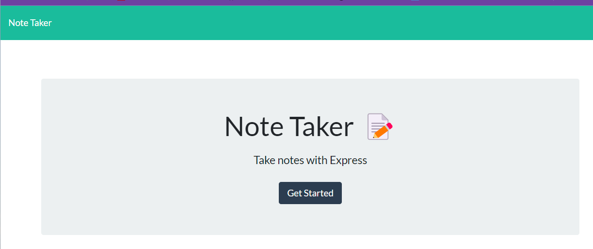
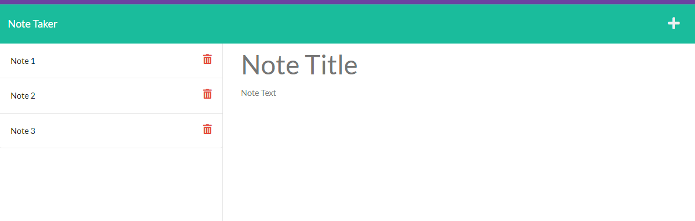
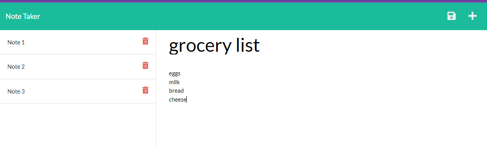
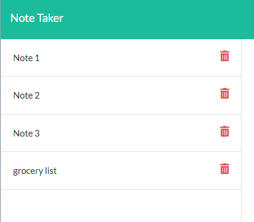

#  note-taker app (OSU Coding Bootcamp--Challenge 11)
    Developed with: Node.js, Express.js, JSON

-----------------------------------------------------------------

##  Description:
    A simple app that uses Node.js and Express.js to take and save notes.

-----------------------------------------------------------------
##  User Story:
    AS A small business owner
    I WANT to be able to write and save notes
    SO THAT I can organize my thoughts and keep track of tasks I need to complete.

-----------------------------------------------------------------
##  Resources:
-----------------------------------------------------------------
##  Screenshots:
LANDING PAGE:

NOTES PAGE:

NOTE (IN-PROGRESS):

NOTE (ADDED TO LIST):  

 

CUSTOM ICON (DISPLAYED IN BROWSER TAB):  

-----------------------------------------------------------------
##  Deployment

### [Heroku-Deployment-Link](https://note-taker-by-meganbeek98.herokuapp.com/)
### [GitHub-Repo-Link](https://github.com/meganbeek98/note-taker.git)

-----------------------------------------------------------------

####  (Developed in 2022, by: Megan Beekman -- [GitHub Profile Link](https://github.com/meganbeek98 'GitHub') )